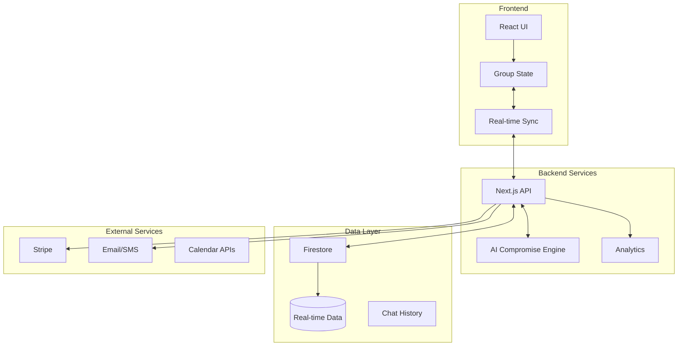

# Group Travel Technical Architecture

## System Architecture Overview



## Core Components

### 1. Real-time Synchronization Layer

```typescript
// Real-time group state management
import { doc, onSnapshot } from 'firebase/firestore';
import { create } from 'zustand';
import { subscribeWithSelector } from 'zustand/middleware';

interface GroupStore {
  // State
  tripId: string | null;
  trip: GroupTrip | null;
  members: GroupMember[];
  preferences: Map<string, UserPreferences>;
  decisions: Decision[];
  messages: Message[];
  
  // Actions
  initializeTrip: (tripId: string) => void;
  updateMemberPreferences: (userId: string, prefs: UserPreferences) => void;
  addDecision: (decision: Decision) => void;
  castVote: (decisionId: string, vote: Vote) => void;
  
  // Real-time subscriptions
  subscribeToTrip: () => void;
  unsubscribeFromTrip: () => void;
}

const useGroupStore = create<GroupStore>()(
  subscribeWithSelector((set, get) => ({
    // Implementation
  }))
);
```

### 2. Anonymous Preference System

```typescript
// Preference encryption for anonymity
class PreferenceManager {
  // Store preferences with one-way hash
  async submitPreferences(
    userId: string,
    groupId: string,
    preferences: UserPreferences
  ) {
    const hashedUserId = await this.hashUserId(userId, groupId);
    
    // Store with hash, not actual userId
    await setDoc(doc(db, 'group_trips', groupId, 'preferences', hashedUserId), {
      ...preferences,
      submittedAt: serverTimestamp(),
      // Don't store actual userId
    });
    
    // Update aggregate preferences
    await this.updateAggregatePreferences(groupId);
  }
  
  private async hashUserId(userId: string, groupId: string): string {
    // One-way hash to maintain anonymity
    return crypto.subtle.digest('SHA-256', 
      new TextEncoder().encode(`${userId}-${groupId}-${SALT}`)
    );
  }
}
```

### 3. AI Compromise Engine

```typescript
// AI-powered compromise generation
class CompromiseEngine {
  async generateCompromises(
    preferences: UserPreferences[],
    constraints: GroupConstraints
  ): Promise<CompromiseSuggestion[]> {
    // Analyze preferences
    const analysis = this.analyzePreferences(preferences);
    
    // Find common ground
    const commonGround = this.findCommonGround(analysis);
    
    // Generate balanced options
    const options = await this.generateOptions({
      commonGround,
      budgetRange: analysis.budgetRange,
      mustHaves: analysis.combinedMustHaves,
      dealBreakers: analysis.allDealBreakers,
    });
    
    // Score for fairness
    return options.map(option => ({
      ...option,
      fairnessScore: this.calculateFairness(option, preferences),
      explanation: this.explainCompromise(option, preferences),
    }));
  }
  
  private calculateFairness(
    option: TravelOption,
    preferences: UserPreferences[]
  ): number {
    // Calculate how well this option satisfies each person
    const satisfactionScores = preferences.map(pref => 
      this.calculateSatisfaction(option, pref)
    );
    
    // Fairness is about equal satisfaction, not max satisfaction
    const mean = average(satisfactionScores);
    const variance = calculateVariance(satisfactionScores);
    
    // Lower variance = more fair
    return (mean * 100) - (variance * 10);
  }
}
```

### 4. Decision Making System

```typescript
// Democratic decision system with veto power
class DecisionSystem {
  async createDecision(
    groupId: string,
    type: DecisionType,
    options: Option[]
  ): Promise<Decision> {
    const decision: Decision = {
      id: generateId(),
      groupId,
      type,
      options,
      votes: new Map(),
      status: 'open',
      createdAt: new Date(),
      deadline: this.calculateDeadline(type),
    };
    
    // Store decision
    await setDoc(doc(db, 'group_trips', groupId, 'decisions', decision.id), decision);
    
    // Notify members
    await this.notifyMembers(groupId, decision);
    
    // Set up auto-resolve
    this.scheduleAutoResolve(decision);
    
    return decision;
  }
  
  async castVote(
    userId: string,
    decisionId: string,
    vote: Vote
  ): Promise<void> {
    // Anonymous voting
    const voteId = await this.generateAnonymousVoteId(userId, decisionId);
    
    await setDoc(
      doc(db, 'decisions', decisionId, 'votes', voteId),
      {
        optionId: vote.optionId,
        isVeto: vote.isVeto,
        timestamp: serverTimestamp(),
      }
    );
    
    // Check if decision should resolve
    await this.checkDecisionResolution(decisionId);
  }
}
```

### 5. Budget Intelligence

```typescript
// Smart budget management
class BudgetIntelligence {
  async analyzeGroupBudget(
    members: GroupMember[]
  ): Promise<BudgetAnalysis> {
    // Get anonymous budget ranges
    const budgets = members.map(m => m.budgetRange);
    
    return {
      safeRange: this.findSafeRange(budgets),
      flexibilityScore: this.calculateFlexibility(budgets),
      suggestions: await this.generateBudgetSuggestions(budgets),
      warnings: this.identifyBudgetRisks(budgets),
    };
  }
  
  private findSafeRange(budgets: BudgetRange[]): BudgetRange {
    // Find range where no one is stretched too thin
    const minBudgets = budgets.map(b => b.min);
    const maxBudgets = budgets.map(b => b.max);
    
    return {
      min: Math.max(...minBudgets) * 0.8, // 80% of highest minimum
      max: Math.min(...maxBudgets) * 0.9, // 90% of lowest maximum
    };
  }
}
```

### 6. Real-time Chat with Context

```typescript
// Context-aware group chat
class GroupChat {
  async sendMessage(
    userId: string,
    groupId: string,
    content: string,
    context?: MessageContext
  ): Promise<void> {
    const message: Message = {
      id: generateId(),
      userId,
      content,
      context,
      timestamp: serverTimestamp(),
      reactions: [],
    };
    
    // Detect references to decisions/options
    const references = this.detectReferences(content, groupId);
    if (references.length > 0) {
      message.references = references;
    }
    
    // Store message
    await addDoc(
      collection(db, 'group_trips', groupId, 'messages'),
      message
    );
    
    // Send notifications
    await this.notifyMembers(groupId, message);
  }
  
  private detectReferences(
    content: string,
    groupId: string
  ): Reference[] {
    // AI-powered reference detection
    // Detects mentions of hotels, activities, decisions, etc.
  }
}
```

## Data Flow Patterns

### 1. Preference Submission Flow
```
User → Anonymous Preference Form → Hashed Storage → Aggregate Calculation → Group View
```

### 2. Decision Making Flow
```
AI Suggests → Group Reviews → Anonymous Voting → Fairness Check → Auto-Resolution → Booking
```

### 3. Budget Protection Flow
```
Individual Budget → Private Storage → Safe Range Calculation → Option Filtering → Overspend Warning
```

## Security & Privacy Considerations

1. **Anonymous Preferences**
   - One-way hashing of user IDs
   - Aggregate views only
   - No reverse lookup possible

2. **Budget Privacy**
   - Never shown individually
   - Only ranges and aggregates
   - Encrypted at rest

3. **Vote Privacy**
   - Anonymous vote storage
   - Only results shown
   - No vote tracking

4. **Chat Security**
   - End-to-end encryption option
   - Message retention policies
   - GDPR compliance

## Performance Optimizations

1. **Real-time Updates**
   - Firestore listeners for live data
   - Debounced updates
   - Optimistic UI updates

2. **Caching Strategy**
   - Cache group data locally
   - Prefetch common decisions
   - Offline support

3. **AI Response Times**
   - Pre-calculate common scenarios
   - Progressive enhancement
   - Background processing

## Monitoring & Analytics

```typescript
// Anonymous analytics for improvement
class GroupAnalytics {
  async trackGroupSuccess(groupId: string) {
    // Track without identifying individuals
    const metrics = {
      planningDuration: calculateDuration(),
      satisfactionScores: getAnonymousScores(),
      compromiseEffectiveness: measureCompromises(),
      completionRate: checkIfBooked(),
    };
    
    await analytics.track('group_trip_complete', metrics);
  }
}
```